  

### About me

I build AI systems that do real work:

- **AI agents & automation**: multi-agent workflows with agent SDKs, tool use, and LLM pipelines that run business processes end to end.
- **AI-powered RPA & scraping**: robots that read, navigate, and extract data where there's no API, with LLMs handling the messy parts.
- **Data collection**: public data sources and databases turned into clean, structured datasets.

### Stack

  

**AI**: Claude · OpenAI · Agent SDKs · MCP · LLM pipelines 
**Automation & scraping**: Playwright · Selenium · n8n · RPA
